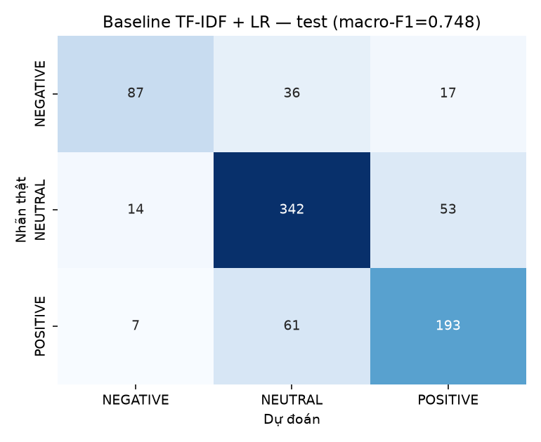

# Baseline — TF-IDF + Logistic Regression

Tách từ bằng `underthesea.word_tokenize`, cache ở `data/interim/tokenized_cache.parquet`.
Đặc trưng: TF-IDF 1-2 gram, `min_df=2`, `max_features=50000`, `sublinear_tf=True`.
Mô hình: `LogisticRegression(class_weight="balanced", max_iter=2000)`, `random_state=42`.

## 1. Chọn siêu tham số trên val

|    C |   macroF1_val_nhan_tay |   acc_val_nhan_tay |   macroF1_val_day_du |
|-----:|-----------------------:|-------------------:|---------------------:|
|  0.1 |                 0.6859 |             0.7174 |               0.766  |
|  0.5 |                 0.6809 |             0.7391 |               0.8178 |
|  1   |                 0.6966 |             0.7609 |               0.8229 |
|  3   |                 0.7003 |             0.7609 |               0.8452 |
| 10   |                 0.7003 |             0.7609 |               0.8556 |

C tốt nhất: **3.0**. Fit lại trên train+val rồi đánh giá trên test.

> Val chứa tới 94% nhãn `weak_model` do một mô hình TF-IDF+LR sinh ra.
> Chọn C trên val đầy đủ sẽ thưởng cho mô hình nào bắt chước nhãn yếu giỏi
> nhất chứ không phải mô hình đọc tin giỏi nhất, và đẩy C lên 10 do khớp
> chặt với chính họ mô hình đã sinh ra nhãn. Cột `macroF1_val_nhan_tay` là
> cross-validation 5-fold trên riêng phần nhãn đọc tay của train+val — đây
> mới là tiêu chí chọn. Cột val đầy đủ giữ lại để đối chiếu.

## 2. Kết quả trên test

| Chỉ số | Giá trị |
|---|---|
| macro-F1 | **0.7483** |
| accuracy | 0.7679 |
| weighted-F1 | 0.7659 |

## 3. Classification report

```
              precision    recall  f1-score   support

    NEGATIVE      0.806     0.621     0.702       140
     NEUTRAL      0.779     0.836     0.807       409
    POSITIVE      0.734     0.739     0.737       261

    accuracy                          0.768       810
   macro avg      0.773     0.732     0.748       810
weighted avg      0.769     0.768     0.766       810
```

## 4. Confusion matrix

Hàng = nhãn thật, cột = dự đoán.

| | NEGATIVE | NEUTRAL | POSITIVE |
|---|---|---|---|
| **NEGATIVE** | 87 | 36 | 17 |
| **NEUTRAL** | 14 | 342 | 53 |
| **POSITIVE** | 7 | 61 | 193 |



## 5. Từ khóa mô hình học được

**NEGATIVE** — 20 đặc trưng trọng số cao nhất:

`giảm`, `bị`, `bán`, `lỗ`, `bán ra`, `đăng_ký bán`, `khởi_tố`, `cổ_phiếu`, `ra`, `thua_lỗ`, `còn`, `xử_phạt`, `lũy_kế`, `do`, `lỗ lũy_kế`, `giảm mạnh`, `báo lỗ`, `bị khởi_tố`, `vi_phạm`, `phạt`

**NEUTRAL** — 20 đặc trưng trọng số cao nhất:

`ngân_hàng`, `phát_hành`, `cổ_phiếu thưởng`, `thưởng`, `việt_nam`, `lãi_suất`, `cho`, `ông`, `thường_niên`, `và`, `sẽ`, `bổ_nhiệm`, `tổng_giám_đốc`, `vốn_điều_lệ`, `vietcombank`, `góp`, `thường_niên năm`, `phát_hành gần`, `gửi`, `bằng cổ_phiếu`

**POSITIVE** — 20 đặc trưng trọng số cao nhất:

`tăng`, `tăng_trưởng`, `lợi_nhuận`, `mua`, `tiền_mặt`, `đăng_ký mua`, `mua vào`, `cổ_tức`, `tin_vui`, `dự_án`, `lãi`, `000`, `khởi_công`, `cổ_tức tiền_mặt`, `hose`, `000 tỷ`, `tỷ`, `tăng trần`, `trần`, `đạt`

## 6. Kết quả riêng trên phần nhãn người

Test có **22** bài mang nhãn do người gán (`source_detail == "human"`).

- macro-F1: **0.5165**
- accuracy: 0.5000

Cỡ mẫu nhỏ nên khoảng tin cậy rất rộng, chỉ dùng để đối chiếu định tính.

### Thành phần nguồn nhãn của test set

| Nguồn | Số bài |
|---|---:|
| `claude_manual` | 788 |
| `human` | 22 |

Test set không chứa nhãn `weak_model`, toàn bộ là nhãn đọc tay. Đây là lý do con số trên test đáng tin hơn train.

## 7. Hạn chế

- Train chứa ~89% nhãn `weak_model` do mô hình yếu lan truyền, nên trần hiệu năng bị giới hạn bởi chất lượng nhãn chứ không phải bởi mô hình.
- TF-IDF không nắm được phủ định xa và ngữ cảnh, ví dụ *"không hoàn tất giao dịch mua"* dễ bị đọc thành tín hiệu mua vào.
- Mô hình không biết `primary_ticker` là chủ thể hay chỉ được nhắc thoáng qua, dù ticker có mặt trong `text_input`.
