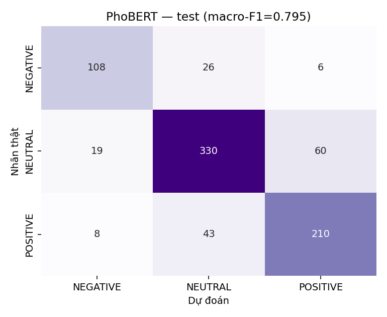
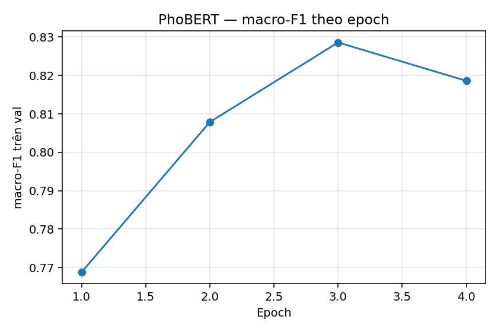

# PhoBERT fine-tuned

Base model: `vinai/phobert-base`, `num_labels=3`, `max_length=256`.
Văn bản được tách từ bằng `underthesea.word_tokenize` **trước khi** tokenize — bỏ bước này điểm tụt mạnh.

## 1. Siêu tham số đã dùng

| Tham số | Giá trị |
|---|---|
| learning_rate | 2e-05 |
| batch size | 16 |
| epochs | 4 |
| warmup_ratio | 0.1 |
| weight_decay | 0.01 |
| early stopping patience | 2 |
| class weights | có, tính từ tần suất nhãn train |
| phần cứng | GPU |
| seed | 42 |

## 2. Kết quả trên test

| Chỉ số | Giá trị |
|---|---|
| macro-F1 | **0.7948** |
| accuracy | 0.8000 |
| weighted-F1 | 0.8002 |

## 3. Classification report

```
              precision    recall  f1-score   support

    NEGATIVE      0.800     0.771     0.785       140
     NEUTRAL      0.827     0.807     0.817       409
    POSITIVE      0.761     0.805     0.782       261

    accuracy                          0.800       810
   macro avg      0.796     0.794     0.795       810
weighted avg      0.801     0.800     0.800       810
```

## 4. Confusion matrix

| | NEGATIVE | NEUTRAL | POSITIVE |
|---|---|---|---|
| **NEGATIVE** | 108 | 26 | 6 |
| **NEUTRAL** | 19 | 330 | 60 |
| **POSITIVE** | 8 | 43 | 210 |



## 5. Đường cong macro-F1 theo epoch (val)

| Epoch | macro-F1 val |
|---|---|
| 1.00 | 0.7688 |
| 2.00 | 0.8079 |
| 3.00 | 0.8286 |
| 4.00 | 0.8186 |



> Val chứa ~94% nhãn `weak_model`, nên đường cong này phản ánh mức khớp
> với nhãn yếu chứ không hoàn toàn là năng lực đọc tin. Dùng nó để chọn
> checkpoint thì được, dùng nó làm con số báo cáo thì không.

## 6. Kết quả riêng trên phần nhãn người

- n = 22
- macro-F1: **0.5225**
- accuracy: 0.5455

Cỡ mẫu nhỏ, chỉ dùng đối chiếu định tính.

### Nguồn nhãn của test set

| Nguồn | Số bài |
|---|---:|
| `claude_manual` | 788 |
| `human` | 22 |

## 7. Định dạng đầu vào khi dùng lại model

Input phải có dạng `"[TICKER] Tiêu đề. Đoạn dẫn"` và **phải tách từ** trước khi đưa vào tokenizer:

```python
from transformers import AutoTokenizer, AutoModelForSequenceClassification
from underthesea import word_tokenize
import torch

tok = AutoTokenizer.from_pretrained('models/phobert-vnfin')
model = AutoModelForSequenceClassification.from_pretrained('models/phobert-vnfin')

text = '[HPG] Hòa Phát báo lãi kỷ lục quý 2. Lợi nhuận tăng 48% so với cùng kỳ.'
seg = word_tokenize(text, format='text')
x = tok(seg, return_tensors='pt', truncation=True, max_length=256)
print(model.config.id2label[model(**x).logits.argmax(-1).item()])
```

## 8. Hạn chế

- ~89% nhãn train do mô hình yếu lan truyền; trần hiệu năng bị chặn bởi chất lượng nhãn chứ không phải kiến trúc.
- Chỉ đọc tiêu đề + sapo, không đọc toàn văn.
- Độ chính xác gán `primary_ticker` ước tính ~85%, sai ticker thì nhãn sai theo dù mô hình đọc đúng nội dung.
- Dữ liệu một nguồn (CafeF), khoảng thời gian ngắn (12/2024–08/2026).
- KHÔNG dùng cho quyết định đầu tư thật.
